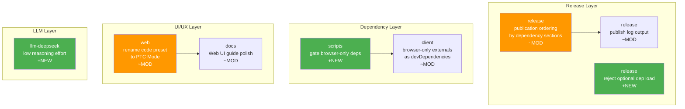

# Architecture Evolution & Design Log · 2026-08-14

> 28 commits (含 merges)，~22 non-merge commits。当日聚焦于 release 发布排序优化、browser-only 依赖隔离、PTC 模式重命名、LLM low reasoning effort 支持、以及 Web UI 指南打磨。

## 1. 每日架构演进图

> 本图反映当日最重要的架构演进路径和设计拓扑。

## 2. 设计模式与重构

- **应用的设计模式**：
  - **Strategy Pattern**：publication ordering 按每个 installed dependency section 排序（`47399764c5`），而非 flat dependency list
  - **Guard Pattern**：reject module-scope load of optional dependency（`7b973e27c8`），防止运行时缺失依赖的 crash
  - **Adapter Pattern**：browser-only dependencies 通过 notices dry run 被 gate out（`6e77499326`）

- **模块解耦与接口定义**：
  - client 的 browser-only externals 从 runtime dependencies 移到 devDependencies（`93a95e838d`），明确了浏览器/Node 边界
  - scripts 模块新增 notices tier 机制，记录 browser-bundled packages 如何被 disclosed（`1fae5dc40e`, `7d59006fd1`）

- **基础设施与性能**：
  - Safari textarea soft-wrap shrink 修复（`4edbdd443e`）
  - history pagination stack overflow 修复（`5201b84863`）

## 3. 特性交付与系统影响

- **核心特性**：
  - **Release Publication Ordering**：publication 按 installed dependency sections 排序（`47399764c5`），publish progress 针对整个 release set 计数（`d5be1d62c9`），publish order 和 peer edges 被打印（`9fa0575ccc`）。解决了 npm publish 的依赖顺序问题。
  - **Browser-Only Dependency Gating**：scripts 模块 gate browser-only dependencies out of install face（`6e77499326`），client 声明 browser-only externals 为 devDependencies（`93a95e838d`）。明确了浏览器/Node 的依赖边界。
  - **PTC Mode Rename**：code preset 重命名为 PTC Mode（`fd24df156d`），UI 使用 sentence case（`3a793a0f7b`）。术语统一。
  - **LLM Low Reasoning Effort**：DeepSeek provider 支持 low reasoning effort（`226600147e`），为 model 提供了更精细的推理控制。

- **系统拓扑影响**：
  - Publication ordering 改变了 npm publish 的执行顺序，影响所有 release 流程
  - Browser-only dependency gating 明确了 client 模块的运行时边界，影响所有 browser bundle
  - PTC mode rename 影响所有引用 code preset 的文档和配置

## 4. 架构决策与 Roadmap 对齐

- **关键技术决策（ADR 推断）**：
  - **背景与痛点**：npm publish 的依赖顺序问题导致发布失败，browser-only dependencies 在 Node 环境中不需要但增加了安装体积
  - **选择的方案与 Trade-offs**：publication 按 dependency sections 排序而非 flat list，更精确但增加了排序逻辑复杂度。browser-only deps 移到 devDependencies，简化了 runtime 但需要 build-time 处理
  - **PTC Mode 命名**：从 code preset 到 PTC Mode，更准确地描述了其"Prompt-Template-Completion"的本质

- **产品 Roadmap 支撑**：
  - Publication ordering 确保了 release 流程的可靠性
  - Browser-only gating 优化了安装体验
  - PTC mode rename 提升了术语的一致性

## 5. 开发者/架构师决策推断

- **开发者意图重建**：
  - **思维模型**：开发者在发版后继续优化 release 流程和依赖管理，同时进行术语统一和能力扩展
  - **优先级选择**：先修复 release 流程（publication ordering），再优化依赖（browser-only gating），最后统一术语（PTC rename）
  - **有意取舍**：publication ordering 选择按 sections 排序而非 topological sort，复杂度更低但可能不够精确

- **架构师决策推断**：
  - **模块拆分粒度**：browser-only dependency 的粒度是每个 package，而非整个 client bundle
  - **时机判断**：在首次公开发布后优化，确保外部用户获得可靠的体验
  - **后续影响**：browser-only gating 为未来的 browser/Node 分离奠定了基础

- **Code Review 视角**：
  - 首先关注 publication ordering（`47399764c5`），验证 dependency sections 的排序逻辑
  - 会向提交者提问：如果两个 package 在同一个 section 中有循环依赖，排序如何处理？
  - 做得好：reject optional dep load（`7b973e27c8`）是一个优秀的防御性编程实践
  - 可改进：PTC mode rename 需要更新所有引用 code preset 的文档

## 6. 技术债务与风险评估

- **已知风险 / 变通方案**：
  - publication ordering 可能不处理循环依赖，需要 fallback 机制
  - browser-only dependency gating 需要确保 build-time 处理不会引入新的问题
  - PTC mode rename 可能影响现有的配置文件

- **建议的下一步**：
  - 为 publication ordering 添加循环依赖检测
  - 为 browser-only dependency gating 添加 build-time 验证
  - 为 PTC mode rename 添加 migration guide
