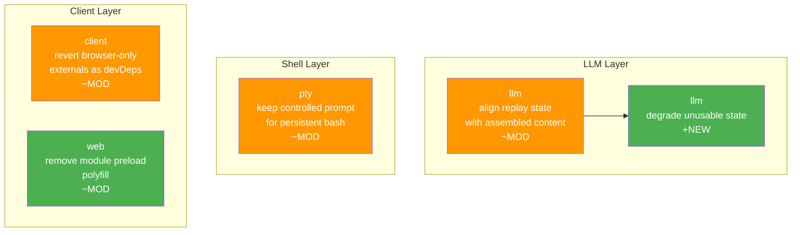

# Architecture Evolution & Design Log · 2026-08-15

> 7 commits (含 merges)，~4 non-merge commits。当日是发版后的稳定化日，聚焦于 LLM replay state 对齐、PTY 持久化 prompt 修复、browser-only externals revert、以及 module preload polyfill 移除。

## 1. 每日架构演进图

> 本图反映当日最重要的架构演进路径和设计拓扑。

## 2. 设计模式与重构

- **应用的设计模式**：
  - **Guard Pattern**：LLM replay state 对齐时 degrade unusable state（`7e95a00c8a`），确保不完整的 state 不会导致 crash
  - **State Pattern**：PTY controlled prompt 的状态管理（`a8dc6f9776`），persistent bash 需要保持 prompt 状态

- **模块解耦与接口定义**：
  - client 的 browser-only externals revert（`f2830fec6d`），回退了 8/14 的变更，可能是发现了兼容性问题
  - module preload polyfill 移除（`ef249da2e9`），简化了浏览器加载路径

- **基础设施与性能**：
  - module preload polyfill 移除是一个性能优化，减少了浏览器端的 JS 体积
  - PTY controlled prompt 修复确保了 persistent bash 的快速启动

## 3. 特性交付与系统影响

- **核心特性**：
  - **LLM Replay State Alignment**：replay state 与 assembled content 对齐（`7e95a00c8a`），unusable state 被 degrade 而非 crash。这是 LLM streaming 稳定性的关键修复。
  - **PTY Controlled Prompt**：persistent bash 保持 controlled prompt（`a8dc6f9776`），确保 shell 会话的快速恢复
  - **Browser-Only Externals Revert**：回退了 browser-only externals 到 devDependencies 的变更（`f2830fec6d`），可能是发现了 runtime 依赖问题
  - **Module Preload Polyfill 移除**：移除了 module preload polyfill（`ef249da2e9`），简化了浏览器加载

- **系统拓扑影响**：
  - LLM replay state 对齐影响所有使用 LLM streaming 的插件
  - PTY controlled prompt 修复影响 shell capability 的用户体验
  - browser-only externals revert 可能需要重新审视 8/14 的依赖边界设计

## 4. 架构决策与 Roadmap 对齐

- **关键技术决策（ADR 推断）**：
  - **背景与痛点**：LLM replay state 与 assembled content 不一致可能导致 streaming 错误，persistent bash 启动慢
  - **选择的方案与 Trade-offs**：replay state 对齐选择 degrade 而非 crash，更健壮但可能丢失部分 state。PTY controlled prompt 选择保持状态而非重新初始化，更快但增加了状态管理复杂度
  - **Browser-Only Externals Revert**：回退表明 8/14 的设计可能过于激进，需要更渐进的依赖边界调整

- **产品 Roadmap 支撑**：
  - LLM replay state 对齐确保了 streaming 的可靠性
  - PTY controlled prompt 提升了 shell 体验
  - Module preload polyfill 移除优化了浏览器性能

## 5. 开发者/架构师决策推断

- **开发者意图重建**：
  - **思维模型**：开发者在发版后进行稳定化工作，修复 edge case 和性能问题
  - **优先级选择**：先修复 LLM replay（核心功能），再修复 PTY（shell 体验），最后优化浏览器性能
  - **有意取舍**：replay state 选择 degrade 而非 crash，健壮性优先于完整性

- **架构师决策推断**：
  - **模块拆分粒度**：LLM replay state 的粒度是每个 assembled content unit
  - **时机判断**：在首次公开发布后修复 edge case，确保外部用户的稳定性
  - **后续影响**：browser-only externals revert 可能需要重新设计依赖边界

- **Code Review 视角**：
  - 首先关注 LLM replay state 对齐（`7e95a00c8a`），验证 degrade 逻辑的正确性
  - 会向提交者提问：degrade 后的 state 如何恢复？是否有重试机制？
  - 做得好：PTY controlled prompt 修复确保了 persistent bash 的快速启动
  - 可改进：browser-only externals revert 需要更详细的 root cause 分析

## 6. 技术债务与风险评估

- **已知风险 / 变通方案**：
  - LLM replay state degrade 可能导致部分功能不可用，需要监控
  - browser-only externals revert 可能需要重新审视依赖边界设计
  - module preload polyfill 移除可能影响旧版浏览器的兼容性

- **建议的下一步**：
  - 为 LLM replay state degrade 添加监控和告警
  - 为 browser-only externals revert 添加 root cause 分析
  - 为 module preload polyfill 移除添加浏览器兼容性测试
