# Architecture Evolution & Design Log · 2026-08-17

## 1. 每日架构演进图

> 本图反映当日最重要的架构演进路径和设计拓扑。

```mermaid
graph TD
    subgraph "Phase 1: Web UI Feature Delivery"
        A1["packages/client/ui-user-questions<br/>QuestionComposer.tsx<br/>+NEW collapsible toggle"]
        A2["packages/client/ui-conversation<br/>InputBar.tsx<br/>safari.ts +NEW"]
        A3["packages/client/ui-conversation<br/>history pagination<br/>~MOD stack overflow fix"]
        A4["packages/client/ui-conversation<br/>pwsh-terminal overlay<br/>~MOD dedup loader"]
    end

    subgraph "Phase 2: Settings Plugin Surface"
        B1["packages/settings/settings<br/>namespace registry<br/>~MOD serve all namespaces"]
        B2["packages/client/ui-settings<br/>plugin cards<br/>+NEW per-namespace cards"]
    end

    subgraph "Phase 3: LLM Provider Consistency"
        C1["packages/llm/llm/assembler.ts<br/>~MOD replay state alignment"]
        C2["packages/llm/llm/types.ts<br/>~MOD degrade unusable state"]
    end

    subgraph "Phase 4: Cross-Protocol Content Bridge"
        D1["packages/acp/acp/content.ts<br/>+NEW durable image bridge"]
        D2["packages/acp/acp/codec.ts<br/>~MOD image encode/decode"]
        D3["packages/mcp/mcp-client/tools.ts<br/>~MOD image tool return"]
        D4["packages/attachment/attachment<br/>~MOD error handling +NEW"]
    end

    subgraph "Phase 5: Terminal Infrastructure"
        E1["packages/subprocess/subprocess-local<br/>node-pty 1.2 beta"]
        E2["packages/terminal/terminal-bash<br/>~MOD controlled prompt"]
    end

    subgraph "Phase 6: Python SDK Testing"
        F1["python/smoke-python-runtime.py<br/>~MOD model-visible assertions"]
        F2["test-support snapshots<br/>+NEW model-visible.json"]
    end

    subgraph "Phase 7: Release & CI"
        G1["222 package.json files<br/>~MOD version bump"]
        G2[".github/workflows/ci.yml<br/>~MOD Windows timeout 120min"]
    end

    A1 --> A2
    A3 --> A4
    B1 --> B2
    C1 --> C2
    D1 --> D2
    D1 --> D3
    D1 --> D4
    E1 --> E2
    F1 --> F2

    classDef new fill:#4CAF50,stroke:#388E3C,color:#fff
    classDef mod fill:#FF9800,stroke:#F57C00,color:#fff
    classDef unchanged fill:#9E9E9E,stroke:#757575,color:#fff

    class A1,D1,F2 new
    class A2,A3,A4,B1,B2,C1,C2,D2,D3,D4,E2,F1,G1,G2 mod
```



## 2. 设计模式与重构

- **应用的设计模式**：
  - **Component Composition Pattern（React 组件组合模式）**：`QuestionComposer.tsx` 引入折叠/展开状态机，将 UI 状态（collapse/expand）与业务状态（draft、question index）解耦。折叠态下 option body 和 footer 通过条件渲染 unmount，而非 CSS 隐藏。
  - **Adapter Pattern（适配器模式）**：ACP `content.ts` 新增 238 行的图片内容桥接层，将 MCP 的图片编码格式适配为 ACP 协议的 durable attachment 格式，实现跨协议内容持久化。
  - **Graceful Degradation Pattern**：LLM assembler 新增 `degrade unusable state` 逻辑，当 replay 状态与 assembled content 不一致时降级处理而非抛出异常。

- **模块解耦与接口定义**：
  - ACP `codec.ts` 重构 image encode/decode 接口，将原始的 `base64` 传输层与 durable attachment 存储层解耦（`packages/acp/acp/src/codec.ts`）。
  - Settings 命名空间注册机制重构：从硬编码特定 namespace 改为遍历所有已注册 namespace 动态生成 plugin cards（`packages/settings/settings`）。

- **基础设施与性能**：
  - node-pty 升级至 1.2 beta，为 persistent bash session 提供更稳定的进程管理（`packages/subprocess/subprocess-local`）。
  - Safari textarea soft-wrap shrink 修复：通过新增 `safari.ts` 工具模块处理 Safari 特有的 CSS 渲染差异（`packages/client/ui-conversation/src/client/skeleton/safari.ts`）。

## 3. 特性交付与系统影响

- **核心特性**：
  - **Ask-User Question Card 折叠功能**：用户在多问题回答场景中可折叠问题列表，避免对话被底部卡片遮挡。折叠/展开状态由 QuestionFlow local state 管理，不会丢失 draft 和 question index。
  - **ACP-MCP 图片内容桥接**：解决了 MCP 工具返回的图片内容无法跨协议持久化到 ACP session 的问题。新增 `content.ts` 模块处理图片的 encode/decode/bridge 三阶段流程。
  - **Settings Plugin Surface 暴露**：每个注册的 namespace 和 key 现在自动在 settings UI 中生成对应的 plugin card，消除了手动注册的需要。

- **系统拓扑影响**：
  - ACP-MCP 桥接变更影响 `packages/acp/acp`、`packages/mcp/mcp-client`、`packages/attachment/attachment`、`packages/core/tools` 四个包的交互边界，是当日影响范围最广的变更。
  - Settings namespace 注册变更影响所有通过 `settings-file` provider 注册配置的插件，向后兼容（新增自动暴露，不移除已有配置）。

## 4. 架构决策与 Roadmap 对齐

- **关键技术决策（ADR 推断）**：
  - **背景与痛点**：ACP 协议的 durable attachment 机制不支持 MCP 工具返回的图片内容格式，导致跨协议 session replay 时图片内容丢失（PR #2252）。
  - **选择的方案与 Trade-offs**：在 ACP 层引入 content bridge 适配层（而非在 MCP 层修改返回格式），保持了 MCP 工具的无状态性，但增加了 ACP 编解码的复杂度。
  - **背景与痛点**：LLM assembler 在 replay 时可能遇到 assembled content 与 replay state 不一致的情况，导致 token 计数错误或请求失败（PR #2596）。
  - **选择的方案与 Trade-offs**：引入 degrade 机制而非强一致性校验，牺牲了严格正确性换取了容错能力。

- **产品 Roadmap 支撑**：
  - 多协议内容桥接为后续 MCP 工具生态扩展（如图片分析、多模态工具）奠定基础。
  - Settings plugin surface 自动化为第三方插件开发者降低了配置 UI 集成的门槛。
  - `0.1.0-rc.7` 发布标志着项目进入 RC 阶段，稳定性优先于功能扩展。

## 5. 开发者/架构师决策推断

- **开发者意图重建**：
  - **思维模型**：当日开发者在处理一个"收敛"任务——将多个已开发完成但未合并的特性（PR #2252、#2308、#2404 等）集中合并到 master，并发布 RC 版本。这是一个典型的 release preparation 模式。
  - **优先级排序**：先合并 bug fix（Safari textarea、history pagination、pwsh overlay），再合并 feature（collapsible question card、settings surface），最后是 release commit。这反映了"稳定性先于功能"的优先级。
  - **有意取舍**：node-pty 升级选择 beta 版本而非 stable，表明 terminal 基础设施需要新特性支撑但尚未完全稳定；Windows CI timeout 提升到 120 分钟是临时方案，而非根治 CI 性能问题。

- **架构师决策推断**：
  - **模块拆分粒度**：ACP content bridge 被独立为 `content.ts` 模块（238 行），而非内联到 `index.ts`，体现了"单一职责"原则——bridge 逻辑与 ACP 协议逻辑分离。
  - **抽象层引入时机**：Settings namespace 动态注册是在已有 settings 基础设施成熟后的优化，而非从一开始就设计，这符合"演进式架构"的理念。
  - **对后续可扩展性的影响**：ACP-MCP 桥接模式为未来其他协议内容（如音频、视频）的跨协议持久化提供了模板。
  - **作为架构师，我会赞同/质疑哪些选择**：赞同 content bridge 的模块化拆分；质疑 LLM assembler 的 degrade 机制是否过于宽泛——是否应该在 degrade 时发出警告而非静默降级。

- **Code Review 视角**：
  - **首先关注的变更**：ACP-MCP content bridge（PR #2252），因为它涉及 4 个包的交互，且改变了跨协议内容持久化的核心行为。
  - **会向提交者提出的问题**：ACP content bridge 是否处理了所有图片格式（PNG/JPG/WebP/GIF）？degrade 机制是否有可观测性（日志/指标）？
  - **做得好**：collapsible question card 的 state 管理（draft、question index 在 collapse/expand 时保持不变）设计精巧；Safari 兼容性修复通过独立模块处理而非条件分支扩散。
  - **可以改进**：release commit 修改了 222 个 package.json，是否有自动化脚本生成？手动修改存在遗漏风险。

## 6. 技术债务与风险评估

- **已知风险 / 变通方案**：
  - node-pty 1.2 beta 升级可能引入未知的平台兼容性问题，特别是在 Windows 上（CI timeout 已提升到 120 分钟作为缓解）。
  - LLM assembler degrade 机制缺乏可观测性——静默降级可能导致难以追踪的 token 计数偏差。
  - Safari textarea 修复仅覆盖 soft-wrap shrink 场景，其他 Safari 特有的 CSS 渲染差异（如 `dvh` 单位、`backdrop-filter`）可能仍存在。

- **建议的下一步**：
  - 为 LLM assembler degrade 路径添加结构化日志和 metrics，便于生产环境监控。
  - 为 ACP content bridge 添加集成测试覆盖所有图片格式的端到端流程。
  - 考虑将 release commit 的 package.json 版本更新自动化为 CI 脚本，避免手动修改。

---

## 阶段性深度分析（当日 commit ≥ 5 个时生成）

### 阶段 1: Web UI Feature Delivery & Polish

**涉及的 Commits**: `4b25b0e76d` `db959a0879` `fec00fcb2c` `cb8756b838` `fc497af8f7`

**阶段意图**：集中交付 Web UI 的用户体验改进——包括新的交互能力（question card 折叠）、跨浏览器兼容性修复（Safari textarea）、以及已有功能的稳定性修复（history pagination、pwsh overlay）。

**开发者视角推断**：
- **思维模型**：开发者在处理一个"UI 收敛"批次——将多个独立开发的 Web UI 改进集中合并。这些 PR 的编号跨度很大（#1371 到 #2504），说明它们是在不同时间段独立开发的。
- **优先级选择**：先合并 feature（collapsible question card），再合并 bug fix（Safari、pagination、overlay），最后添加测试覆盖。这反映了"功能完整后再修复边缘 case"的策略。
- **有意取舍**：collapsible question card 选择在组件内部管理 collapse state（而非提升到全局 store），是一个有意的"局部性"决策——避免全局状态膨胀，但牺牲了跨组件同步的可能性。

**架构师视角推断**：
- **粒度考量**：每个 Web UI 修复都被拆分为独立 PR（而非合并为一个大 PR），体现了"小步快跑"的发布策略。
- **时机判断**：Safari textarea 修复和 history pagination 修复在 RC 阶段合并，表明这些是已知的用户痛点，需要在发布前解决。
- **后续影响**：collapsible question card 的 state 管理模式（draft + question index 在 collapse/expand 时保持）为后续其他可折叠组件提供了参考实现。

**重点关注的文档/代码**：

| 文件/模块 | 路径 | 阅读要点 |
|-----------|------|----------|
| QuestionComposer | `packages/client/ui-user-questions/src/client/QuestionComposer.tsx` | 折叠/展开状态机实现，关注 QuestionFlow local state 如何管理 draft 和 question index |
| Safari Compatibility | `packages/client/ui-conversation/src/client/skeleton/safari.ts` | Safari 特有的 CSS 渲染差异处理，关注 42 行新代码的具体适配逻辑 |
| InputBar | `packages/client/ui-conversation/src/client/skeleton/InputBar.tsx` | Safari textarea soft-wrap shrink 修复，关注 CSS 属性调整 |
| History Pagination | `packages/host/apiproxy/src/api-proxy.ts` | stack overflow 修复，关注递归深度限制或分页逻辑重构 |
| Pwsh Terminal Overlay | `apps/web/tests/pwsh-terminal.overlay.yml` | duplicate-loader entry 修复的测试用例 |

**关键代码模式**：
```typescript
// packages/client/ui-user-questions/src/client/QuestionComposer.tsx
// 折叠/展开状态机：collapse 不影响 draft 和 question index
// QuestionFlow local state 管理
// 新增 minimize toggle 与 dismiss action 并列

// packages/client/ui-conversation/src/client/skeleton/safari.ts
// Safari 特有的 CSS 渲染适配
// 独立模块处理浏览器差异，避免条件分支扩散
```

**领域建模洞察**（DDD 视角）：
- **值对象**：QuestionComposer 的 draft 和 question index 是值对象——它们在 collapse/expand 时被复制而非引用传递。
- **聚合根**：QuestionFlow 是聚合根，管理 question set 的生命周期（包括折叠状态）。
- **边界上下文**：Web UI（client packages）与 API proxy（host packages）在 history pagination 修复中跨越了边界——pagination 问题可能涉及前后端数据流。

**AI Agent 能力演进**（如适用）：
- collapsible question card 改变了 agent 与用户的交互模式——用户可以在不丢失上下文的情况下最小化问题列表，这在多问题场景（如 agent 同时请求多个权限）中提升了可用性。

---

### 阶段 2: Settings Plugin Surface & Naming Alignment

**涉及的 Commits**: `8f998186a9` `66cd593bf3`

**阶段意图**：扩展 settings 基础设施以自动暴露所有注册 namespace 的 plugin cards，同时修复 UI 中的命名不一致问题（English code preset → PTC mode）。

**开发者视角推断**：
- **思维模型**：开发者在处理"配置 UI 可发现性"问题——之前 settings UI 需要手动注册每个 namespace 的 card，现在改为自动遍历。这是一个典型的"消除手工步骤"优化。
- **优先级选择**：settings surface 是功能改进（PR #2404），命名修复是 polish（PR #2559），两者在同一阶段合并说明它们都属于"发布前打磨"。
- **有意取舍**：自动遍历所有 namespace 可能暴露一些内部/实验性的 namespace 到 settings UI，但开发者选择了"先暴露再隐藏"而非"先过滤再暴露"——这是有意的"默认开放"策略。

**架构师视角推断**：
- **粒度考量**：settings 基础设施的重构（PR #2404 涉及 37 文件、851 行新增）是一个较大的变更，但被拆分为独立 PR 而非与其他功能合并，体现了对"基础设施变更"的谨慎态度。
- **时机判断**：在 RC 阶段引入 settings surface 自动化，表明团队认为这是发布前必须解决的用户体验问题。
- **后续影响**：自动暴露 namespace 意味着后续添加新插件时无需手动更新 settings UI，降低了维护成本。

**重点关注的文档/代码**：

| 文件/模块 | 路径 | 阅读要点 |
|-----------|------|----------|
| Settings Namespace Registry | `packages/settings/settings/` | 如何遍历所有已注册 namespace 并生成 plugin cards |
| UI Settings Plugin Inventory | `packages/client/ui-settings-plugin-inventory/` | plugin inventory 的 UI 渲染逻辑 |
| Agent Preset Locales | `packages/client/ui-agent-preset/src/client/locales.ts` | "English" → "PTC mode" 命名变更 |

**关键代码模式**：
```typescript
// packages/settings/settings/
// 遍历所有注册的 namespace 和 key，动态生成 plugin cards
// 从硬编码特定 namespace 改为基于注册表的动态发现

// packages/client/ui-agent-preset/src/client/locales.ts
// 命名对齐：English code preset → PTC mode
// 仅修改 locale 字符串，不影响逻辑
```

**领域建模洞察**（DDD 视角）：
- **聚合根**：Settings namespace registry 是聚合根，管理所有配置命名空间的注册和发现。
- **领域事件**：namespace 注册是一个领域事件——当新插件注册时，settings UI 自动响应。
- **边界上下文**：Settings 基础设施（packages/settings）与 Settings UI（packages/client/ui-settings）之间通过 namespace registry 解耦。

**AI Agent 能力演进**（如适用）：
- settings surface 自动化降低了第三方插件开发者将配置暴露给用户的门槛，间接扩展了 agent 的可配置性生态。

---

### 阶段 3: LLM Provider Consistency & Replay Robustness

**涉及的 Commits**: `84257ea5de`

**阶段意图**：修复 LLM assembler 在 replay 场景下状态不一致的问题，引入 degrade 机制处理 unusable state，确保 token 计数和请求组装的鲁棒性。

**开发者视角推断**：
- **思维模型**：开发者在处理一个"边界条件"——当 assembled content（系统提示词 + 工具 schemas + 历史消息）与 replay state（已消耗的 token 数、消息偏移量）不一致时，之前的行为是抛出异常导致请求失败，现在改为 degrade 降级处理。
- **优先级选择**：在 RC 阶段修复此类问题表明这是生产环境已发现或可能触发的 edge case。
- **有意取舍**：degrade 机制牺牲了严格正确性（可能产生 slightly incorrect token counts）换取了容错能力（请求不会失败）。这是一个典型的"可用性 > 正确性"权衡。

**架构师视角推断**：
- **粒度考量**：变更集中在 `assembler.ts`（41 行修改）和 `types.ts`（25 行修改），加上 79 行新增测试，粒度适中。
- **时机判断**：在 RC 阶段引入 degrade 机制，表明团队认为严格一致性校验过于脆弱，需要更宽容的容错策略。
- **后续影响**：degrade 机制可能掩盖其他潜在的 state 不一致问题，需要可观测性（日志/指标）来监控。

**重点关注的文档/代码**：

| 文件/模块 | 路径 | 阅读要点 |
|-----------|------|----------|
| LLM Assembler | `packages/llm/llm/src/assembler.ts` | degrade 逻辑的触发条件和降级策略 |
| LLM Types | `packages/llm/llm/src/types.ts` | unusable state 的类型定义 |
| Assembler Tests | `packages/llm/llm/tests/assembler.spec.ts` | 79 行新增测试覆盖的 edge case |

**关键代码模式**：
```typescript
// packages/llm/llm/src/assembler.ts
// degrade unusable state: 当 replay state 与 assembled content 不一致时
// 降级处理而非抛出异常
// 触发条件：token count 偏差、message offset 越界等

// packages/llm/llm/src/types.ts
// 新增 unusable state 类型定义
// 用于标识哪些 state 组合需要 degrade 处理
```

**领域建模洞察**（DDD 视角）：
- **值对象**：replay state 是值对象——它描述了 LLM 请求组装过程中的中间状态。
- **聚合根**：LLM assembler 是聚合根，管理请求组装的完整生命周期。
- **领域事件**：state 不一致是一个领域事件——触发 degrade 流程。

**AI Agent 能力演进**（如适用）：
- LLM assembler 的鲁棒性直接影响 agent 的可靠性——degrade 机制确保即使在异常状态下，agent 仍能继续处理用户请求。

---

### 阶段 4: Cross-Protocol Content Bridge (ACP-MCP)

**涉及的 Commits**: `8822d6744f`

**阶段意图**：解决 MCP 工具返回的图片内容无法跨协议持久化到 ACP session 的问题，引入 content bridge 适配层实现图片内容的 encode/decode/bridge 三阶段流程。

**开发者视角推断**：
- **思维模型**：开发者在处理一个"协议互操作性"问题——MCP 协议的图片内容格式（通常是 base64 编码）与 ACP 协议的 durable attachment 格式不兼容，导致跨协议 session replay 时图片内容丢失。
- **优先级选择**：PR #2252 的编号很早（7月7日），说明这是一个长期存在的问题，现在终于被解决。在 RC 阶段合并表明这是发布前必须解决的核心功能缺失。
- **有意取舍**：在 ACP 层引入 bridge（而非在 MCP 层修改返回格式）保持了 MCP 工具的无状态性，但增加了 ACP 编解码的复杂度。这是一个"关注点分离"的权衡。

**架构师视角推断**：
- **粒度考量**：新增 `content.ts` 模块（238 行）独立于 `index.ts`，体现了"单一职责"原则——bridge 逻辑与 ACP 协议逻辑分离。
- **时机判断**：在 RC 阶段引入此变更，表明跨协议内容持久化是产品核心能力的一部分，而非可选增强。
- **后续影响**：content bridge 模式为未来其他协议内容（如音频、视频）的跨协议持久化提供了模板。

**重点关注的文档/代码**：

| 文件/模块 | 路径 | 阅读要点 |
|-----------|------|----------|
| ACP Content Bridge | `packages/acp/acp/src/content.ts` | 238 行新代码，图片 encode/decode/bridge 三阶段流程 |
| ACP Codec | `packages/acp/acp/src/codec.ts` | image encode/decode 接口重构 |
| MCP Client Tools | `packages/mcp/mcp-client/src/tools.ts` | 286 行修改，图片工具返回格式适配 |
| Attachment Error | `packages/attachment/attachment/src/error.ts` | 44 行修改，错误处理增强 |
| Attachment Index | `packages/attachment/attachment/src/index.ts` | 33 行修改，attachment 生命周期管理 |
| ACP Tests | `packages/acp/acp/tests/bridge.spec.ts` | 83 行新增测试 |
| ACP Content Tests | `packages/acp/acp/tests/content.spec.ts` | 236 行新增测试 |

**关键代码模式**：
```typescript
// packages/acp/acp/src/content.ts
// 三阶段流程：encode → store → bridge
// 将 MCP 图片内容适配为 ACP durable attachment

// packages/mcp/mcp-client/src/tools.ts
// 286 行修改：工具返回格式适配
// 确保图片内容以 ACP 兼容格式返回

// packages/attachment/attachment/src/error.ts
// 44 行修改：错误处理增强
// 处理 bridge 过程中的格式不兼容、编码失败等场景
```

**领域建模洞察**（DDD 视角）：
- **值对象**：图片内容（base64 + MIME type）是值对象——它在 bridge 过程中被复制而非引用传递。
- **聚合根**：ACP session 是聚合根，管理 durable attachment 的生命周期。
- **边界上下文**：MCP 工具上下文与 ACP session 上下文通过 content bridge 解耦——bridge 处理跨上下文的内容转换。
- **领域事件**：图片内容 bridge 完成是一个领域事件——触发 attachment 持久化。

**AI Agent 能力演进**（如适用）：
- 跨协议内容桥接扩展了 agent 的多模态能力——MCP 工具返回的图片内容现在可以持久化到 ACP session，支持后续的图片分析、对比等场景。

---

### 阶段 5: Terminal & Subprocess Infrastructure

**涉及的 Commits**: `cc68bbf382` `7841e0a93e`

**阶段意图**：升级 node-pty 到 1.2 beta 版本，并修复 persistent bash session 在 minimal mode 下的 prompt settling 问题。

**开发者视角推断**：
- **思维模型**：开发者在处理"终端基础设施稳定性"——node-pty 升级提供更好的进程管理能力，prompt settling 修复确保 persistent bash session 在 minimal mode 下快速稳定。
- **优先级选择**：node-pty 升级是基础设施改进（PR #2517），prompt settling 修复是 bug fix（PR #2586），两者在同一阶段合并说明它们都属于"终端能力收敛"。
- **有意取舍**：node-pty 选择 beta 版本而非 stable，表明需要新特性支撑但尚未完全稳定——这是一个"功能优先于稳定性"的权衡。

**架构师视角推断**：
- **粒度考量**：变更集中在 `terminal-bash` 和 `subprocess-local` 两个包，粒度适中。
- **时机判断**：在 RC 阶段升级 node-pty beta，表明终端能力是产品核心的一部分，需要最新特性。
- **后续影响**：node-pty beta 可能引入未知的平台兼容性问题，需要持续监控。

**重点关注的文档/代码**：

| 文件/模块 | 路径 | 阅读要点 |
|-----------|------|----------|
| Terminal Bash Index | `packages/terminal/terminal-bash/src/index.ts` | controlled prompt 修复，5 行新增 |
| Terminal Bash Tests | `packages/terminal/terminal-bash/tests/local.spec.ts` | 20 行新增测试 |
| Subprocess Local Build | `scripts/build-exe-for-python-sdk-native-pty.ts` | node-pty 升级相关的构建脚本调整 |

**关键代码模式**：
```typescript
// packages/terminal/terminal-bash/src/index.ts
// controlled prompt: 保持 controlled prompt 使 persistent bash 快速稳定
// minimal mode 下的 prompt settling 修复

// scripts/build-exe-for-python-sdk-native-pty.ts
// node-pty 1.2 beta 升级相关的构建脚本调整
```

**领域建模洞察**（DDD 视角）：
- **聚合根**：Terminal session 是聚合根，管理 persistent bash session 的生命周期。
- **值对象**：controlled prompt 是值对象——它描述了 bash session 的初始状态。

**AI Agent 能力演进**（如适用）：
- terminal 基础设施的稳定性直接影响 agent 的 shell 执行能力——persistent bash session 的快速 settling 确保 agent 可以快速恢复之前的执行上下文。

---

### 阶段 6: Python SDK Testing & Model-Visible Assertions

**涉及的 Commits**: `8692a1b76b` `b3eaafe3ae`

**阶段意图**：为 Python SDK 的 minimal composition 添加 model-visible surface 断言，确保 Python SDK 与 TypeScript SDK 在 agent loop、session lifecycle、SessionEventMap 上的行为一致。

**开发者视角推断**：
- **思维模型**：开发者在处理"SDK 一致性验证"——Python SDK 之前只验证了 system-role messages，现在需要验证完整的 model-visible surface（tool schemas、message list 等）。
- **优先级选择**：PR #2462 的编号较早，说明这是长期缺失的测试覆盖。在 RC 阶段补齐表明团队认为 SDK 一致性是发布质量的关键指标。
- **有意取舍**：排除了动态 runtime-context snapshot（macOS 和 Linux 不一致），选择在 model-visible.json 中只记录 platform-independent 内容——这是"可移植性 > 完整性"的权衡。

**架构师视角推断**：
- **粒度考量**：变更集中在 `smoke-python-runtime.py`（149 行修改）和新增 `model-visible.json`（430 行），粒度适中。
- **时机判断**：在 RC 阶段补齐 Python SDK 测试覆盖，表明团队认为 SDK 一致性是发布质量的关键指标。
- **后续影响**：model-visible.json 作为 golden file，后续 Python SDK 变更需要同步更新。

**重点关注的文档/代码**：

| 文件/模块 | 路径 | 阅读要点 |
|-----------|------|----------|
| Python Smoke Test | `scripts/smoke-python-runtime.py` | 149 行修改，model-visible assertions 逻辑 |
| Model-Visible Snapshot | `test-support/snapshots/minimal/model-visible.json` | 430 行新增，minimal composition 的 model-visible surface golden file |
| Agent Note | `.agents/notes/implemented/feature/2026-08-13-python-minimal-model-visible-snapshot.md` | 设计决策记录 |

**关键代码模式**：
```python
# scripts/smoke-python-runtime.py
# model-visible assertions: 验证 minimal composition 的完整 model-visible surface
# 包括 tool schemas、message list 等
# 排除 platform-dependent 的 runtime-context snapshot
```

**领域建模洞察**（DDD 视角）：
- **值对象**：model-visible surface 是值对象——它描述了 agent 与 LLM 交互的完整接口。
- **聚合根**：minimal composition 是聚合根，管理 Python SDK 的最小可运行配置。
- **边界上下文**：Python SDK 与 TypeScript SDK 通过 model-visible surface 对齐——这是跨语言 SDK 一致性的关键。

**AI Agent 能力演进**（如适用）：
- Python SDK 的 model-visible assertions 确保了 agent 在 Python 和 TypeScript 两种语言实现下的行为一致性，扩展了 agent 的语言生态。

---

### 阶段 7: Release & CI Infrastructure

**涉及的 Commits**: `ed5a10b6e1` `bb4ca698d6`

**阶段意图**：发布 dsh-0.1.0-rc.7 版本（222 个 package.json 版本更新），并提升 Windows CI timeout 到 120 分钟以应对 CI 性能问题。

**开发者视角推断**：
- **思维模型**：开发者在处理"发布准备"——release commit 更新所有 package.json 版本号，CI timeout 提升是缓解 Windows CI 性能问题的临时方案。
- **优先级选择**：release commit 是最终步骤，CI timeout 提升是发布前的基础设施保障。
- **有意取舍**：Windows CI timeout 提升到 120 分钟是临时方案，而非根治 CI 性能问题——这是"发布优先于优化"的权衡。

**架构师视角推断**：
- **粒度考量**：release commit 修改了 222 个 package.json，是当日变更范围最广的 commit，但内容高度机械化（仅版本号更新）。
- **时机判断**：在 RC 阶段发布 0.1.0-rc.7，表明项目进入了发布前的最后打磨阶段。
- **后续影响**：222 个 package.json 的版本更新如果手动完成，存在遗漏风险——建议自动化。

**重点关注的文档/代码**：

| 文件/模块 | 路径 | 阅读要点 |
|-----------|------|----------|
| Package.json Files | `packages/*/*/package.json` | 222 个文件的版本号更新 |
| CI Workflow | `.github/workflows/ci.yml` | Windows timeout 从默认值提升到 120 分钟 |
| Release Agent Note | `.agents/notes/implemented/process/2026-08-08-native-windows-pull-request-ci.md` | CI 决策记录 |

**关键代码模式**：
```yaml
# .github/workflows/ci.yml
# Windows CI timeout: 120 minutes
# 临时方案，应对 Windows native CI 性能问题
```

**领域建模洞察**（DDD 视角）：
- **聚合根**：release 版本是聚合根，管理所有 package 的版本号一致性。
- **领域事件**：release 发布是一个领域事件——触发所有下游消费者的版本更新。

**AI Agent 能力演进**（如适用）：
- release 发布标志着 agent 框架的稳定性里程碑——RC 版本意味着核心 API 冻结，后续变更以 bug fix 为主。
