# Architecture Evolution & Design Log · 2026-08-18

## 1. 每日架构演进图

> 本图反映当日最重要的架构演进路径和设计拓扑。当日 124 个 non-merge commit，涵盖 Subagent Provider Named Instances、Agent Teams Runtime、Client Plugin Architecture、LLM Retry Consolidation、Web UI Features 等多个并行工作流。

```mermaid
graph TD
    subgraph Subagent["Subagent Provider Named Instances"]
        SC[+NEW subagent-claude-code<br/>named instances]
        SX[+NEW subagent-codex<br/>named instances]
        SF[~MOD failure provenance<br/>& process settlement]
        SR[+NEW subagent report<br/>next-step delivery]
    end

    subgraph Teams["Agent Teams Runtime"]
        TR[+NEW packages/team/team<br/>durable runtime]
        TT[+NEW packages/team/tool-team<br/>team tool]
        TI[~MOD incubate to<br/>packages/experimental]
    end

    subgraph Client["Client Plugin Architecture"]
        CR[+NEW packages/client/render-service<br/>dynamic plugin]
        CA[~MOD packages/client/ui-attachment<br/>as plugin]
        CS[~MOD packages/client/ui-settings<br/>schema absorbed]
        CB[~MOD bootstrap loop<br/>& handoff queue]
    end

    subgraph LLM["LLM Retry & Config"]
        LR[~MOD one five-retry default]
        LC[~MOD centralize deployment<br/>retry defaults]
        LP[~MOD pi-ai wire-compat<br/>surface exposed]
    end

    subgraph Web["Web UI Features"]
        WF[+NEW file-open failure<br/>handling]
        WM[+NEW model picker<br/>bulk selection]
        WC[+NEW connection handling<br/>POSIX home path]
    end

    SC --> SF
    SX --> SF
    SF --> SR
    TR --> TI
    TT --> TI
    CR --> CB
    CA --> CB
    LR --> LC

    style SC fill:#2d6,color:#fff
    style SX fill:#2d6,color:#fff
    style TR fill:#2d6,color:#fff
    style TT fill:#2d6,color:#fff
    style CR fill:#2d6,color:#fff
    style WF fill:#2d6,color:#fff
    style WM fill:#2d6,color:#fff
    style WC fill:#2d6,color:#fff
    style SF fill:#da3,color:#fff
    style SR fill:#2d6,color:#fff
    style TI fill:#da3,color:#fff
    style CA fill:#da3,color:#fff
    style CS fill:#da3,color:#fff
    style CB fill:#da3,color:#fff
    style LR fill:#da3,color:#fff
    style LC fill:#da3,color:#fff
    style LP fill:#da3,color:#fff
```



**图例**: `+NEW` = 新增模块/能力 · `~MOD` = 修改/重构现有模块

## 2. 设计模式与重构

- **应用的设计模式**：
  - **Named Instance Pattern**：Subagent Claude Code 和 Codex provider 引入 named instance 支持，本质上是 **Strategy + Factory** 的组合——通过名称索引多实例 provider，运行时按名称解析具体策略。
  - **Dynamic Plugin Pattern**：Client 架构重构将 `web rendering`、`attachment UI`、`schema handling` 拆分为独立的 Cordis 动态插件，应用了 **Microkernel** 架构模式——核心 bootstrap 只负责启动和 handoff，功能由插件注册。
  - **Observer + Event Sourcing**：Agent Teams runtime 使用 mailbox、task-board、fold 等模块，体现了 event-sourced 的协作模型。

- **模块解耦与接口定义**：
  - `packages/client/render-service` 新增，将 React 渲染从 `web/` 包解耦为独立的 client plugin，通过 `DocumentTitle.tsx` 和 `app.tsx` 定义渲染契约。
  - `packages/client/schema-form` 被废弃，schema 处理移入 `packages/client/ui-settings/src/client/schema.ts`——这是一个**消除中间层**的重构。
  - Subagent 模块将 Claude 和 Codex 的 failure provenance 拆分为独立的 fact tracking，取代了之前的统一处理。

- **基础设施与性能**：
  - CI 并行化：coverage 和 web snapshots 在同一 job 内并行执行（`ef75b6ff2f`）。
  - LLM retry 默认值统一为 five-retry，消除了多处分散的 retry 配置。

## 3. 特性交付与系统影响

- **核心特性**：
  - **Named Provider Instances**（`db52686a96`, `49351cbf0e`）：允许在同一主机上运行多个 Claude Code / Codex 实例，每个实例有独立的名称标识。这是 multi-tenant agent 部署的基础设施。
  - **Agent Teams Runtime**（`3546f595b9`）：新增 8299 行代码，包含 roster、mailbox、task-board、fold 等核心模块，实现 durable agent 协作。随后被 incubate 到 `packages/experimental/`（`570aff0e27`），表明团队对发布成熟度有严格分层。
  - **Dynamic Client Plugin Architecture**（`f37bc082c5` 等）：Client 从单体 web 包演进为插件化架构，支持运行时动态加载 UI 组件。

- **系统拓扑影响**：
  - `packages/client/web/` 不再直接导出 React 组件，改为通过 `render-service` 插件注册。
  - Subagent provider 的配置 schema 变更影响了所有使用 `product-subagent-both.cordis.yml` 的场景。
  - `packages/team/` 移动到 `packages/experimental/team/` 影响了所有 monorepo 内部引用。

## 4. 架构决策与 Roadmap 对齐

- **关键技术决策（ADR 推断）**：
  - **背景与痛点**：Subagent provider 之前只有单一实例，无法支持同一 agent 系统中多个 Claude/Codex 后端并存；Client 的 React 渲染逻辑与 web 包强耦合，阻碍了独立部署和测试。
  - **选择的方案与 Trade-offs**：
    - Named instances：引入 name 作为 provider 标识的 part of the key，增加了配置复杂度但获得了多实例能力。
    - Dynamic plugin：将渲染从 web 包拆出为独立 plugin，增加了 bootstrap 复杂度（handoff queue、ownership boundaries）但获得了模块化和可测试性。
    - Teams incubation：选择将未成熟的 runtime 放入 experimental 而非直接发布，牺牲了 early feedback 但保护了 API surface。

- **产品 Roadmap 支撑**：
  - Named instances 支撑 multi-agent/multi-tenant 部署场景。
  - Agent Teams 是 agent 协作能力的基础，支撑复杂工作流编排。
  - Client plugin 化是 Web UI 可维护性的关键里程碑。

## 5. 开发者/架构师决策推断

- **开发者意图重建**：
  - **思维模型**：开发者在处理 subagent named instances 时，脑中的系统画面是"多个 provider 并行运行，每个有独立生命周期"。他们关注的是 process exit facts 的完整性和 failure provenance 的可追溯性。
  - **优先级排序**：先完成 Claude 和 Codex 的 named instance 支持，然后处理 failure provenance（因为多实例场景下错误追踪更复杂），最后处理 CI 稳定性。
  - **有意取舍**：Agent Teams 选择 incubation 而非直接发布，说明团队认为 API surface 还没稳定，宁可推迟也不引入 breaking changes。

- **架构师决策推断**：
  - **模块拆分粒度**：Client plugin 拆分选择了细粒度（render-service、ui-attachment、ui-settings 各自独立），而非将整个 web 包作为单一 plugin。这表明团队预见到这些组件会独立演进。
  - **抽象层引入时机**：在 subagent failure handling 中引入了 `failure provenance` 和 `process diagnostics` 的分离，说明在多实例场景下，统一的错误处理已不够用。
  - **对后续可扩展性的影响**：Named instance 模式为未来的 provider federation 和 load balancing 打下基础。
  - **作为架构师，你会赞同/质疑哪些选择**：赞同 Teams incubation 的谨慎态度；质疑 `schema-form` 包的完全删除是否过于激进——是否有其他消费者？

- **Code Review 视角**：
  - **首先关注**：`f37bc082c5`（render-service 拆分）——这是最大的架构变更，涉及 98 个文件。
  - **会提出的问题**：bootstrap handoff queue 的边界条件是什么？如果 render-service 加载失败，boot page 是否仍然可见？
  - **做得好的**：subagent failure provenance 的逐步细化（从 `cd4f8b7f46` 到 `8debb798d8`），每一步都有对应的测试。
  - **可以改进的**：部分 `fix: ci` 提交信息过于模糊（如 `f15ca23386`、`996f6e49a5`），不利于后续追溯。

## 6. 技术债务与风险评估

- **已知风险 / 变通方案**：
  - Client bootstrap 复杂度显著增加：handoff queue + ownership boundaries + dependency cleanup 是新的故障点。
  - Agent Teams 代码量（8299 行）在 incubation 阶段可能缺乏足够的 error path 测试。
  - 部分 `fix: ci` 提交表明 CI 环境存在不稳定性，特别是在 Windows 平台上。

- **建议的下一步**：
  - 为 Client bootstrap 流程添加 integration test，覆盖 render-service 加载失败的场景。
  - Agent Teams 在 incubation 期间应建立 API surface 的 compatibility contract。
  - CI 的 Windows 相关 fix 应追溯根因，避免后续重复修复。

---

## 阶段性深度分析

### 阶段 1: Subagent Named Instances & Failure Handling

**涉及的 Commits**: `49351cbf0e` `db52686a96` `ec3da3809a` `bf2e9e474c` `b032097c2a` `8debb798d8` `7fb9de99b5` `6ebf8d199d` `d91df8cbd5` `20cd777753` `f0b2d7c762` `4c6ff93535` `fded16f688` `77211b1c26` `cd4f8b7f46` `6bae03dd69`

**阶段意图**：解决单一 subagent provider 实例的限制，支持在同一主机上运行多个 Claude Code 和 Codex 实例，并建立完善的 failure provenance 追踪机制。

**开发者视角推断**：
- **思维模型**：开发者脑中的系统画面是"一个 agent 系统需要同时使用多个不同的 LLM 后端，每个后端可能有多个实例"。他们关注的核心问题是：当一个实例失败时，如何准确识别是哪个实例、什么环节出了问题。
- **优先级选择**：先实现 named instance 的基础结构（Claude 和 Codex），然后逐步完善 failure handling。这表明"多实例能力"是比"完美错误处理"更高优先级的。
- **有意取舍**：failure provenance 的多步细化（从简单 exit facts 到完整 provenance chain）表明开发者在"快速交付"和"完备性"之间选择了前者，后续逐步补齐。

**架构师视角推断**：
- **粒度考量**：Claude 和 Codex 的 named instance 支持是分别实现的（两个独立 commit），而非抽象出一个通用的 named provider 接口。这表明两个后端的差异性足够大，不值得过早抽象。
- **时机判断**：在 Agent Teams runtime 之前实现 named instances，是因为 Teams 需要多实例作为前提。
- **后续影响**：Named instance 模式可能成为 provider federation 的基础——未来可能需要跨主机的 provider 管理。

**重点关注的文档/代码**：

| 文件/模块 | 路径 | 阅读要点 |
|-----------|------|----------|
| subagent-claude-code | `packages/subagent/subagent-claude-code/src/index.ts` | named instance 的配置 schema 和初始化逻辑 |
| subagent-codex | `packages/subagent/subagent-codex/src/index.ts` | 与 Claude 的差异点，特别是 process settlement |
| continuation.ts | `packages/subagent/subagent/src/continuation.ts` | 多实例场景下的 continuation 传递 |

**关键代码模式**：
```typescript
// Named instance configuration pattern
// packages/subagent/subagent-claude-code/src/index.ts
// 每个实例有独立的 name、command 和 config
// failure provenance 通过 process exit facts 追踪
```

**领域建模洞察**（DDD 视角）：
- **聚合根**：Subagent Provider 是聚合根，named instance 是其 identity 的一部分。
- **值对象**：Failure provenance 是值对象，包含 cause、exit code、stderr tail 等不可变属性。
- **领域事件**：Process exit、spawn error、settlement 完成等事件驱动了状态转换。
- **边界上下文**：Subagent 和 Teams 之间有清晰的边界——Subagent 管理单个 provider 实例的生命周期，Teams 管理多个 agent 之间的协作。

**AI Agent 能力演进**：
- Agent 的 tool 注册机制从"单一 provider"演进为"多 provider named instances"，支持更灵活的后端选择。
- Subagent report 在 next step delivery，使得 agent 可以在执行过程中获取子任务的结果。

---

### 阶段 2: Agent Teams Runtime

**涉及的 Commits**: `3546f595b9` `0283d62c76` `570aff0e27`

**阶段意图**：实现 durable agent 协作运行时，支持多个 agent 之间的任务分配、消息传递和状态持久化，随后将其 incubate 到 experimental 包组。

**开发者视角推断**：
- **思维模型**：开发者在设计 Agent Teams 时，脑中的系统画面是"多个 agent 通过 mailbox 通信，任务在 task-board 上分配，状态通过 fold 持久化"。这是一个典型的 event-sourced 协作模型。
- **优先级选择**：先实现完整的 runtime（包括 roster、mailbox、task-board、fold），然后在 review 后立即 incubate。这表明团队对 experimental 的定义非常严格——任何未经过生产验证的代码都必须标记为 experimental。
- **有意取舍**：8299 行新代码是一次性提交的，说明团队选择了"大块交付"而非"增量演进"，可能是因为 Teams 功能的内部依赖性太强。

**架构师视角推断**：
- **粒度考量**：team/team 和 team/tool-team 被拆分为两个包，前者是 runtime 核心，后者是 tool 集成。这种拆分表明 tool 集成层可能独立演进。
- **时机判断**：在 named instances 之后、在 client plugin 架构之前实现 Teams，是因为 Teams 需要多实例作为基础，而 client 架构变更可能影响 Teams 的 UI 集成。
- **后续影响**：Incubation 到 experimental 意味着 Teams 的 API surface 在正式发布前可能有 breaking changes。

**重点关注的文档/代码**：

| 文件/模块 | 路径 | 阅读要点 |
|-----------|------|----------|
| roster.ts | `packages/team/team/src/roster.ts` | agent 注册和发现机制 |
| mailbox.ts | `packages/team/team/src/mailbox.ts` | agent 间消息传递模型 |
| task-board.ts | `packages/team/team/src/task-board.ts` | 任务分配和状态管理 |
| fold.ts | `packages/team/team/src/fold.ts` | 状态持久化的 event-sourcing 实现 |

**关键代码模式**：
```typescript
// Event-sourced collaboration pattern
// packages/team/team/src/fold.ts
// 通过 fold 函数将事件流折叠为状态快照
// 支持 durable persistence 和 replay
```

**领域建模洞察**（DDD 视角）：
- **聚合根**：Team 是聚合根，包含 roster（成员列表）、task-board（任务列表）。
- **实体**：Agent 是实体，有独立的 identity 和生命周期。
- **值对象**：Message（mailbox 中的消息）、Task（task-board 上的任务）是值对象。
- **领域事件**：Agent join/leave、Task assign/complete 等事件驱动状态转换。
- **边界上下文**：Teams 和 Subagent 之间的边界——Subagent 管理单个 provider 的进程，Teams 管理多个 agent 的协作。

**AI Agent 能力演进**：
- Agent 从"单打独斗"演进为"团队协作"，支持任务分解和并行执行。
- Tool-team 提供了 agent 可以使用的协作工具（创建团队、分配任务等）。

---

### 阶段 3: Client Plugin Architecture Refactoring

**涉及的 Commits**: `f37bc082c5` `3e4ad10d05` `56dff07c4e` `cf5e686408` `07484b9474` `c065ba34d1` `e1777b7891` `8088d2a6a0` `cf603b847f` `4ad6e28663` `0fda2a26b7` `2f974ca9b0` `85fa5b6943`

**阶段意图**：将 Client 从单体 web 包演进为插件化架构，支持运行时动态加载 UI 组件（render-service、attachment、schema），同时建立明确的 ownership boundaries 和 bootstrap 流程。

**开发者视角推断**：
- **思维模型**：开发者脑中的系统画面是"web 包是一个 monolith，所有 React 组件、样式、schema 处理都耦合在一起"。他们的目标是将其拆分为可独立部署和测试的 plugin。
- **优先级选择**：先拆分 render-service（因为它是最大的组件），然后拆分 attachment UI（因为它有独立的生命周期），最后处理 schema（因为它被其他包依赖）。这是一个从"最独立"到"最耦合"的拆分顺序。
- **有意取舍**：选择将 schema-form 包完全删除而非保留为 shim，表明团队处于 pre-release 阶段，可以自由地进行 breaking changes。

**架构师视角推断**：
- **粒度考量**：render-service 被拆分为独立包而非留在 web 包中，表明它可能被其他客户端（如 CLI）复用。
- **时机判断**：在 Agent Teams incubation 之后进行 client 重构，是因为 Teams 的 UI 集成可能依赖新的 plugin 架构。
- **后续影响**：Bootstrap handoff queue 和 ownership boundaries 的引入为未来的 lazy loading 和 code splitting 打下基础。

**重点关注的文档/代码**：

| 文件/模块 | 路径 | 阅读要点 |
|-----------|------|----------|
| render-service | `packages/client/render-service/src/client/index.ts` | plugin 注册和渲染契约 |
| boot.ts | `packages/client/web/src/boot.ts` | bootstrap 流程和 handoff queue |
| schema.ts | `packages/client/ui-settings/src/client/schema.ts` | 从 schema-form 迁移来的 schema 处理 |

**关键代码模式**：
```typescript
// Dynamic plugin bootstrap pattern
// packages/client/web/src/boot.ts
// 通过 handoff queue 管理 plugin 加载顺序
// ownership boundaries 确保组件间的解耦
```

**领域建模洞察**（DDD 视角）：
- **聚合根**：Client App 是聚合根，包含多个 plugin（render-service、attachment、settings）。
- **值对象**：Schema、Settings 是不可变的值对象。
- **边界上下文**：Client 和 Web 之间的边界——Client 管理 UI 组件和状态，Web 管理路由和页面级逻辑。

**AI Agent 能力演进**：
- Client plugin 化使得 agent 的 UI 可以动态加载和卸载，支持更灵活的 agent 界面定制。
- Plugin loading progress 的显示（`2f974ca9b0`）提升了用户体验，特别是在大量 plugin 加载时。

---

### 阶段 4: LLM Retry & Configuration Consolidation

**涉及的 Commits**: `0ca0f3d0b8` `1dbafe2973` `5372fc384e` `884f7b9c41` `0b4a322003` `5849c57c0c`

**阶段意图**：统一 LLM 层的 retry 默认值为 five-retry，集中部署级 retry 配置，并完善 pi-ai wire-compat surface 和 image payload bounds。

**开发者视角推断**：
- **思维模型**：开发者关注的是"LLM 调用的可靠性"——retry 策略分散在多处，配置不一致。他们的目标是统一这些配置，减少维护负担。
- **优先级选择**：先统一 retry 默认值（影响面最广），然后集中配置，最后处理 wire-compat 和 image payload（更具体的场景）。
- **有意取舍**：选择 five-retry 而非可配置的 retry 策略，表明团队在"灵活性"和"简单性"之间选择了后者。

**架构师视角推断**：
- **粒度考量**：retry 配置的集中化是通过一个 central defaults 对象实现的，而非分散在各处的环境变量。这表明团队偏好显式配置。
- **后续影响**：Unified retry default 为未来的 retry policy per-provider 打下基础。

**重点关注的文档/代码**：

| 文件/模块 | 路径 | 阅读要点 |
|-----------|------|----------|
| retry defaults | `packages/llm/llm/src/...` | centralize deployment retry defaults 的具体实现 |
| pi-ai context | `packages/llm/llm-pi-ai/src/context.ts` | wire-compat surface 的暴露方式 |

**关键代码模式**：
```typescript
// Centralized retry defaults
// 通过一个 DEFAULT_RETRIES 常量统一所有 LLM 调用的 retry 策略
// 部署级配置可覆盖默认值
```

**领域建模洞察**（DDD 视角）：
- **值对象**：RetryPolicy 是不可变的值对象，包含 maxRetries、backoff strategy 等属性。
- **边界上下文**：LLM 和 Provider 之间的边界——LLM 定义 retry 策略，Provider 实现具体的 retry 逻辑。

**AI Agent 能力演进**：
- 统一的 retry 策略使得 agent 在使用不同 LLM provider 时有一致的可靠性体验。
- Image payload bounds 的引入支持了 multimodal 场景下的资源管理。

---

### 阶段 5: Web UI Features & Improvements

**涉及的 Commits**: `aab839a971` `3e1915a3b2` `761d9d1978` `20a5f5a3ee`

**阶段意图**：增强 Web UI 的交互能力，包括文件打开失败处理、模型选择器批量选择、命令错误渲染为 banner、以及 POSIX home path 缩写的连接处理。

**开发者视角推断**：
- **思维模型**：开发者关注的是"用户在使用 Web UI 时的体验痛点"——文件打开失败时无反馈、模型选择效率低、命令错误信息不明显。
- **优先级选择**：先处理文件打开失败（因为它是阻塞性错误），然后批量选择（提升效率），最后错误渲染和连接处理。
- **有意取舍**：批量选择功能选择了简单的 checkbox UI 而非更复杂的 drag-and-drop，表明 MVP 优先。

**架构师视角推断**：
- **粒度考量**：文件打开失败处理是在 chat view 中实现的，而非在全局 error boundary 中。这表明错误是 context-specific 的。
- **后续影响**：模型选择器批量选择为未来的模型预设和 favorites 功能打下基础。

**重点关注的文档/代码**：

| 文件/模块 | 路径 | 阅读要点 |
|-----------|------|----------|
| model picker | `packages/web/...` | bulk selection 的 UI 实现 |
| chat view | `packages/client/ui-conversation/...` | file-open failure handling |

**关键代码模式**：
```typescript
// File-open failure handling in chat view
// 当用户尝试打开文件失败时，在 chat view 中渲染错误 banner
// 提供重试和替代操作选项
```

**领域建模洞察**（DDD 视角）：
- **边界上下文**：Web UI 和 Client 之间的边界——Web 管理页面级逻辑，Client 管理 UI 组件。

**AI Agent 能力演进**：
- 文件打开失败处理使得 agent 在执行文件操作时能更好地向用户反馈错误。
- 模型选择器批量选择支持用户快速切换不同的 LLM 配置。

---

### 阶段 6: Locale & Documentation

**涉及的 Commits**: `9301def7eb` `3967df95f7` `0fe31f11a3` `bf4cb507f1` `8e2785d9eb` `9de06952ab` `6e9b2560a3` `c1c955bb09` `49b48369db`

**阶段意图**：完善 locale 系统的 parity gate、修复 Chinese default 相关的 stale comments、将 README assets 发布到 CDN，并移除重复的 assets。

**开发者视角推断**：
- **思维模型**：开发者关注的是"locale 系统的正确性和一致性"——特别是当 FALLBACK_LOCALE 从 zh 移到 en 后，相关的注释和文档需要同步更新。
- **优先级选择**：先修复 parity gate（因为它是 correctness issue），然后更新文档和 comments，最后处理 CDN 发布。
- **有意取舍**：CDN 发布选择了直接发布而非通过 CI pipeline，可能是因为这是 infrastructure change，不需要严格的 review。

**架构师视角推断**：
- **粒度考量**：parity gate 的修复涉及 regex 模式、register 检测、字典解析等多个方面，表明 locale 系统的复杂度超出了预期。
- **后续影响**：CDN 发布为未来的多区域部署打下基础。

**重点关注的文档/代码**：

| 文件/模块 | 路径 | 阅读要点 |
|-----------|------|----------|
| locale parity gate | scripts/ 相关脚本 | localeOf 的 regex 模式和 register 检测 |
| README assets | community/infra | CDN 发布的具体实现 |

**关键代码模式**：
```typescript
// Locale parity gate with regex pattern
// 要求 name-prefix 的第三位是大写字母 [A-Z]
// 支持 bare register identifier 和 property access
```

**领域建模洞察**（DDD 视角）：
- **值对象**：Locale 是不可变的值对象，包含 name、fallback、browser-derived 等属性。
- **边界上下文**：Locale 和 UI 之间的边界——Locale 定义语言偏好，UI 根据 Locale 渲染内容。

**AI Agent 能力演进**：
- Locale 系统的完善使得 agent 能更好地支持多语言交互。
- CDN 发布为 agent 的多区域部署提供了基础设施支持。

---

### 阶段 7: CI & Testing Infrastructure

**涉及的 Commits**: `ef75b6ff2f` `45a73e3ed5` `d54f6382c8` `975bf864ef` `5ba9e50bb0` `1b9f9ae256` `85e821b926` `96442bd4e5` `78fc31d06b` `75c9f05c6b` `4f64e20b41` `bd1083d78a` `03fd7c003b` `d415b63c19` `72ae04abde` `cede4fdb76` `1b9fd9eaa7` `c3a04de1cf` `3621716704` `0f734991e1` `4be7e7680e` `68f519a74c` `d419b722bb` `dc8991879a` `5648d4ad1c` `cef99b17d4`

**阶段意图**：稳定 CI 环境（特别是 Windows 平台），并为 subagent、llm、web 等模块补充测试覆盖。

**开发者视角推断**：
- **思维模型**：开发者关注的是"CI 的稳定性和测试的完备性"——Windows 覆盖率不稳定、subagent failure 场景缺乏测试、LLM retry 行为未被验证。
- **优先级选择**：先修复 Windows CI（因为它阻塞其他测试），然后补充 subagent 测试（因为 named instances 引入了新的 failure 场景），最后补充 LLM 和 web 测试。
- **有意取舍**：选择移除 flaky subprocess readiness handshake 而非修复它，表明团队对 CI 稳定性的要求高于测试的完备性。

**架构师视角推断**：
- **粒度考量**：测试补充是按模块进行的（subagent、llm、web），而非按功能进行的。这表明团队偏好模块级的测试组织。
- **后续影响**：CI 并行化为未来的更快反馈循环打下基础。

**重点关注的文档/代码**：

| 文件/模块 | 路径 | 阅读要点 |
|-----------|------|----------|
| subagent tests | `packages/subagent/*/tests/` | named instance 和 failure 场景的测试 |
| llm-pi-ai tests | `packages/llm/llm-pi-ai/tests/` | compat validation 和 retry 行为的测试 |
| ci scripts | scripts/ | CI 并行化和 Windows 稳定化的实现 |

**关键代码模式**：
```typescript
// CI parallelization pattern
// coverage 和 web snapshots 在同一 job 内并行执行
// 通过 process isolation 实现并行
```

**领域建模洞察**（DDD 视角）：
- **边界上下文**：CI 和 Product 之间的边界——CI 管理构建和测试流程，Product 管理功能和行为。

**AI Agent 能力演进**：
- CI 稳定性提升使得 agent 的开发迭代速度更快。
- 测试覆盖提升确保了 agent 的行为在各种场景下都是可预测的。

---

### 阶段 8: Python SDK & PowerShell

**涉及的 Commits**: `7bb766fc82` `ee5280bd6e` `94f6fd1306` `d0cdf52030` `2f759a6b65` `91e8d62b2a`

**阶段意图**：完善 Python SDK 的 runtime readiness 和 packaged runtime 行为，支持 MCP in packaged runtime，并对齐 PowerShell persistent PTY 的 contracts。

**开发者视角推断**：
- **思维模型**：开发者关注的是"Python SDK 和 PowerShell 的生产就绪性"——runtime readiness 不明确、packaged runtime 行为不稳定、PTY output 处理有问题。
- **优先级选择**：先修复 runtime readiness（因为它是 SDK 的基础），然后处理 packaged runtime 和 MCP，最后对齐 PTY contracts。
- **有意取舍**：MCP 支持选择了在 packaged runtime 中直接集成而非通过 plugin，表明团队对 MCP 的定位是"核心能力"而非"可选扩展"。

**架构师视角推断**：
- **粒度考量**：PowerShell PTY 的修复是在 subprocess 层面进行的，而非在 shell 层面。这表明问题出在底层进程管理，而非上层 shell 逻辑。
- **后续影响**：Python SDK 的 runtime readiness 为未来的 Python agent 开发打下基础。

**重点关注的文档/代码**：

| 文件/模块 | 路径 | 阅读要点 |
|-----------|------|----------|
| python-sdk | python/ | runtime readiness 和 packaged runtime 的实现 |
| subprocess | `packages/subprocess/` | Windows terminal 检测和 PTY output 处理 |

**关键代码模式**：
```typescript
// Runtime readiness pattern
// Python SDK 在启动时显式检查 runtime 是否就绪
// 避免在 runtime 未就绪时尝试执行 agent 逻辑
```

**领域建模洞察**（DDD 视角）：
- **值对象**：Runtime readiness 是不可变的值对象，包含 isReady、error 等属性。
- **边界上下文**：Python SDK 和 TypeScript SDK 之间的边界——Python SDK 管理 Python agent 的生命周期，TypeScript SDK 管理 TypeScript agent 的生命周期。

**AI Agent 能力演进**：
- Python SDK 的完善使得 agent 可以用 Python 编写，扩展了 agent 的开发语言选择。
- MCP 支持使得 agent 可以使用标准化的 tool 协议，增强了互操作性。
