# Architecture Evolution & Design Log · 2026-08-19

## 1. 每日架构演进图

> 本图反映当日最重要的架构演进路径和设计拓扑。当日 51 个 non-merge commit，涵盖 Agent Teams Rename、DeepSeek Multimodal、SQLite Optimization、Web UI Polish、Release Engineering 等工作流。

```mermaid
graph TD
    subgraph Release["Release Engineering"]
        RR["~MOD dsh 0.1.0-rc.8"]
        RB["+NEW build profile client artifacts"]
        RV["+NEW release validation client build"]
    end

    subgraph Teams["Agent Teams Restructure"]
        TRN["~MOD rename service key"]
        TPN["~MOD prefix experimental package names"]
        TDR["~MOD rename experimental directories"]
    end

    subgraph LLM["DeepSeek Multimodal"]
        DM["+NEW multimodal requests support"]
        DR["~MOD reasoning content pass-through"]
        DP["~MOD pi-ai compat pin types"]
    end

    subgraph Session["SQLite Optimization"]
        SO["~MOD chunk row compression"]
        SP["~MOD persistence seed reuse"]
    end

    subgraph Web["Web UI Polish"]
        WA["~MOD auto-open Web UI by default"]
        WR["~MOD reference UI polish"]
        WFB["+NEW feedback popover note editor"]
        WS["~MOD multi-query web search"]
    end

    subgraph CI["CI & Docs"]
        CE["~MOD remove hosted serial-linux"]
        CL["~MOD brand guidelines bilingual"]
        AR["~MOD abort partial finalize"]
    end

    RR --> RB
    RB --> RV
    TRN --> TPN
    TPN --> TDR
    DM --> DR
    SO --> SP
    WA --> WR
```



**图例**: `+NEW` = 新增模块/能力 · `~MOD` = 修改/重构现有模块

## 2. 设计模式与重构

- **应用的设计模式**：
  - **Rename & Namespace Pattern**：Agent Teams 的 service key 重命名和 experimental package name 前缀化，体现了 Convention over Configuration 的命名策略——通过命名约定标记实验性代码，而非运行时检查。
  - **Data Compression Pattern**：SQLite persistence 的 chunk row compression 引入了 Codec 模式——将事件数据压缩存储，读取时解压，对上层透明。
  - **Build Profile Pattern**：Client artifacts 绑定到 build profiles，体现了 Builder 模式——通过 profile 选择构建产物的组合。

- **模块解耦与接口定义**：
  - Agent Teams 的 directories 重命名和 package name 前缀化是纯粹的重构，不改变功能但明确了 API surface 的成熟度分层。
  - SQLite compression 的引入（`codec.ts`、`compression.ts`）将压缩逻辑从 store 中解耦，使得压缩策略可以独立演进。
  - Web UI 的 auto-open 功能通过 `packages/bundle/web-app/src/startup.ts` 实现，与 CLI 的启动逻辑解耦。

- **基础设施与性能**：
  - SQLite chunk row compression 优化了持久化布局，减少了存储空间和 I/O。
  - Persistence seed reuse（`1c77a78d6a`）避免了重复创建 immutable seed，提升了 session 启动性能。

## 3. 特性交付与系统影响

- **核心特性**：
  - **DeepSeek Multimodal Support**（`7078918b30`）：支持 multimodal requests，包括 image input 和 reasoning content pass-through。这是 DeepSeek 作为 LLM provider 的重要能力提升。
  - **Release dsh 0.1.0-rc.8**（`f1f7dc36fa`）：新版本发布，包含 build profile、client artifact validation 等 release engineering 改进。
  - **Auto-open Web UI**（`d66841ea3f`）：CLI 启动时自动打开 Web UI，降低了用户的启动门槛。

- **系统拓扑影响**：
  - Agent Teams 的 rename 影响了所有引用 teams service key 的配置和代码。
  - SQLite schema 变更（v17）需要向后兼容处理。
  - Brand guidelines 的 bilingual 拆分为未来的多语言文档发布奠定了基础。

## 4. 架构决策与 Roadmap 对齐

- **关键技术决策（ADR 推断）**：
  - **背景与痛点**：Agent Teams 的命名不够规范，experimental 代码和 stable 代码的边界不清晰；SQLite 持久化在大规模 session 下性能不足；用户启动 CLI 后需要手动打开 Web UI。
  - **选择的方案与 Trade-offs**：
    - Teams rename：通过重命名明确 experimental 标识，增加了迁移成本但提升了 API surface 的清晰度。
    - SQLite compression：引入 codec 层增加了代码复杂度但显著减少了存储空间。
    - Auto-open Web UI：通过启动时自动打开降低了用户门槛，但可能在某些环境下（如 headless server）不合适。
  - **Release Engineering**：build profile 和 artifact validation 的引入提升了发布流程的可靠性，但增加了构建复杂度。

- **产品 Roadmap 支撑**：
  - DeepSeek multimodal 支撑了视觉理解场景。
  - Release engineering 改进支撑了更频繁和可靠的版本发布。
  - Auto-open Web UI 支撑了"开箱即用"的用户体验目标。

## 5. 开发者/架构师决策推断

- **开发者意图重建**：
  - **思维模型**：开发者在处理 Agent Teams rename 时，脑中的系统画面是"experimental 代码需要明确的标识，避免用户误用"。他们关注的是 API surface 的清晰度和可维护性。
  - **优先级选择**：先完成 release engineering（因为它是发布 blocker），然后 Teams rename（因为它是 API 清晰度），最后 multimodal 和 SQLite（因为它们是功能增强）。
  - **有意取舍**：Auto-open Web UI 选择了默认开启而非 opt-in，表明团队优先考虑大多数用户的场景。

- **架构师决策推断**：
  - **模块拆分粒度**：SQLite compression 被拆分为 codec.ts 和 compression.ts，而非放在 store.ts 中。这表明压缩策略可能独立演进（如支持不同的压缩算法）。
  - **抽象层引入时机**：Build profile 的引入是在 release 之前，表明团队希望在发布时就有完善的构建流程。
  - **对后续可扩展性的影响**：SQLite schema v17 的 compression 支持为未来的增量备份和版本迁移打下基础。
  - **作为架构师，你会赞同/质疑哪些选择**：赞同 Teams rename 的谨慎态度；质疑 auto-open Web UI 是否应该有 headless 检测。

- **Code Review 视角**：
  - **首先关注**：`93b4b98ef3`（SQLite optimization）——这是最大的功能变更，涉及 92 个文件。
  - **会提出的问题**：compression 的回退策略是什么？如果 compressed data 损坏，如何恢复？
  - **做得好的**：Teams rename 的逐步推进（rename key → prefix names → rename directories），每一步都有对应的文档更新。
  - **可以改进的**：部分 commit 信息过于简短（如 `fix: ci`），不利于后续追溯。

## 6. 技术债务与风险评估

- **已知风险 / 变通方案**：
  - SQLite schema v17 的向后兼容性需要验证——旧版本的 session 文件是否能被新版本读取。
  - Auto-open Web UI 在 headless 环境下可能失败，需要 fallback 策略。
  - Agent Teams 的 experimental 标识可能在短期内导致用户困惑。

- **建议的下一步**：
  - 为 SQLite compression 添加 migration 测试，确保 schema 升级的平滑性。
  - 为 auto-open Web UI 添加 headless 检测和 fallback。
  - 在文档中明确 experimental 代码的使用风险和 API 稳定性承诺。

---

## 阶段性深度分析

### 阶段 1: Release Engineering & Build Profiles

**涉及的 Commits**: `f1f7dc36fa` `803a60264a` `738dcced9b` `66a7081c15` `93cbb3799d`

**阶段意图**：完善 dsh 0.1.0-rc.8 的发布流程，包括 build profile 绑定、client artifact validation 和 release bump manifest paths 修正。

**开发者视角推断**：
- **思维模型**：开发者关注的是"发布流程的可靠性"——build artifacts 需要与 build profiles 绑定，client build 需要 validation，release bump paths 需要正确。
- **优先级选择**：先修复 release bump paths（因为它是发布 blocker），然后绑定 build profiles，最后添加 validation。
- **有意取舍**：选择了在 release 之前完成这些改进，而非在 release 之后作为 hotfix。

**架构师视角推断**：
- **粒度考量**：build profile 和 artifact validation 被拆分为独立的 commit，表明它们是独立的关注点。
- **时机判断**：在 rc.8 之前引入这些改进，表明团队希望在发布时就有完善的构建流程。
- **后续影响**：Build profile 为未来的多平台发布和定制化构建打下基础。

**重点关注的文档/代码**：

| 文件/模块 | 路径 | 阅读要点 |
|-----------|------|----------|
| release validation | `packages/build/` | client artifact validation 的具体实现 |
| build profiles | `packages/bundle/web-app/` | build profile 绑定的配置方式 |

**关键代码模式**：
```typescript
// Build profile binding pattern
// client artifacts 通过 profile 选择构建产物的组合
// 支持不同的部署场景（development、staging、production）
```

**领域建模洞察**（DDD 视角）：
- **值对象**：Build profile 是不可变的值对象，包含 artifacts、config、env 等属性。
- **边界上下文**：Build 和 Release 之间的边界——Build 管理构建流程，Release 管理版本发布。

**AI Agent 能力演进**：
- Release engineering 的完善使得 agent 的版本发布更可靠，用户可以更快地获取最新功能。

---

### 阶段 2: Agent Teams Rename & Restructure

**涉及的 Commits**: `4dd1be1a1f` `0e51d5ffae` `cb93304ec9`

**阶段意图**：将 Agent Teams 的 service key 重命名、package name 添加 experimental 前缀、directories 重命名，明确 experimental 代码的标识。

**开发者视角推断**：
- **思维模型**：开发者关注的是"API surface 的清晰度"——experimental 代码和 stable 代码需要有明确的边界，避免用户误用。
- **优先级选择**：先重命名 service key（影响最小），然后添加 package name 前缀（影响中等），最后重命名 directories（影响最大）。这是一个从低风险到高风险的推进顺序。
- **有意取舍**：选择了三步走的渐进式重构，而非一次性重命名，降低了出错风险。

**架构师视角推断**：
- **粒度考量**：每一步都有对应的文档更新，表明团队重视重构过程中的可追溯性。
- **时机判断**：在 release 之前完成 rename，确保新版本的 API surface 从一开始就清晰。
- **后续影响**：Experimental 标识为未来的 API stability 分层奠定了基础。

**重点关注的文档/代码**：

| 文件/模块 | 路径 | 阅读要点 |
|-----------|------|----------|
| team service key | `packages/experimental/team/team/src/` | rename 后的 service key 定义 |
| package names | `packages/experimental/*/package.json` | experimental 前缀的命名约定 |

**关键代码模式**：
```typescript
// Rename pattern for experimental packages
// 通过 package name 前缀区分 experimental 和 stable
// service key 同步更新以保持一致性
```

**领域建模洞察**（DDD 视角）：
- **边界上下文**：Experimental 和 Stable 之间的边界——Experimental 管理未成熟的 API，Stable 管理已验证的 API。

**AI Agent 能力演进**：
- Agent Teams 的 experimental 标识使得开发者可以更清楚地评估使用风险。

---

### 阶段 3: DeepSeek Multimodal Support

**涉及的 Commits**: `7078918b30` `4a02791c9a` `3b74deec3e` `cf4a27c471`

**阶段意图**：为 DeepSeek LLM provider 添加 multimodal requests 支持，包括 image input 和 reasoning content pass-through，并处理 review findings。

**开发者视角推断**：
- **思维模型**：开发者关注的是"DeepSeek 作为 LLM provider 的能力完整性"——multimodal 是现代 LLM 的核心能力之一，缺失它会限制 agent 的应用场景。
- **优先级选择**：先实现核心 multimodal 功能（`7078918b30`），然后处理 review findings（`4a02791c9a`），最后完善 compat 类型和 gates。
- **有意取舍**：选择在 DeepSeek provider 中直接实现 multimodal，而非通过通用的 multimodal adapter，表明 DeepSeek 的 multimodal API 有独特之处。

**架构师视角推断**：
- **粒度考量**：multimodal 功能被拆分为 serialize、adapter、types 等模块，表明这些是独立的关注点。
- **时机判断**：在 SQLite optimization 之后引入 multimodal，是因为两者没有直接依赖，可以并行开发。
- **后续影响**：Multimodal support 为 agent 的视觉理解能力打下基础。

**重点关注的文档/代码**：

| 文件/模块 | 路径 | 阅读要点 |
|-----------|------|----------|
| serialize.ts | `packages/llm/llm-deepseek/src/serialize.ts` | multimodal content 的序列化逻辑 |
| adapter.ts | `packages/llm/llm-deepseek/src/adapter.ts` | DeepSeek API 的适配层 |

**关键代码模式**：
```typescript
// Multimodal serialization pattern
// 将 image content blocks 序列化为 DeepSeek API 格式
// 支持 base64 和 URL 两种 image input 方式
```

**领域建模洞察**（DDD 视角）：
- **值对象**：Image content block 是不可变的值对象，包含 data、media_type、source 等属性。
- **边界上下文**：LLM Provider 和 Agent 之间的边界——Provider 管理 API 调用，Agent 管理 content 生成。

**AI Agent 能力演进**：
- Multimodal support 使得 agent 可以处理图像输入，扩展了应用场景（如图像分析、UI 理解等）。

---

### 阶段 4: SQLite Persistence Optimization

**涉及的 Commits**: `93b4b98ef3` `1c77a78d6a`

**阶段意图**：优化 SQLite 持久化布局，引入 chunk row compression 和 persistence seed reuse，提升大规模 session 下的存储和启动性能。

**开发者视角推断**：
- **思维模型**：开发者关注的是"SQLite 在大规模 session 下的性能瓶颈"——event 数据量大时，存储空间和 I/O 成为瓶颈。
- **优先级选择**：先实现 compression（影响存储空间），然后 reuse seed（影响启动性能）。这表明存储空间是更紧迫的问题。
- **有意取舍**：选择了 chunk row compression 而非 column compression，是因为 event 数据的行级压缩更灵活。

**架构师视角推断**：
- **粒度考量**：compression 被拆分为 codec.ts 和 compression.ts，使得压缩策略可以独立演进。
- **时机判断**：在 release 之前引入 compression，确保新版本从一开始就有优化的持久化布局。
- **后续影响**：Compression 支持为未来的增量备份和版本迁移打下基础。

**重点关注的文档/代码**：

| 文件/模块 | 路径 | 阅读要点 |
|-----------|------|----------|
| codec.ts | `packages/session/session-persistence-sqlite/src/codec.ts` | 压缩/解压的核心逻辑 |
| compression.ts | `packages/session/session-persistence-sqlite/src/compression.ts` | 压缩策略的实现 |
| schema.ts | `packages/session/session-persistence-sqlite/src/schema.ts` | schema v17 的变更 |

**关键代码模式**：
```typescript
// Chunk row compression pattern
// 将 event 数据按 chunk 压缩存储
// 读取时按需解压，避免全量解压
// 支持多种压缩算法（通过 codec 抽象）
```

**领域建模洞察**（DDD 视角）：
- **值对象**：Compressed chunk 是不可变的值对象，包含 data、algorithm、checksum 等属性。
- **边界上下文**：Session Store 和 SQLite 之间的边界——Session Store 管理 session 生命周期，SQLite 管理物理存储。

**AI Agent 能力演进**：
- SQLite optimization 使得 agent 可以处理更大规模的 session 数据，支持更长的对话历史。

---

### 阶段 5: Web UI Polish & Features

**涉及的 Commits**: `d66841ea3f` `1585e539d2` `988dd7824a` `e2ee5c0f5d` `b06722e2d4` `d57c2d19db` `6b4df99c44` `d792a89c8c`

**阶段意图**：增强 Web UI 的交互体验，包括 auto-open、reference UI polish、feedback popover、multi-query web search 等功能。

**开发者视角推断**：
- **思维模型**：开发者关注的是"用户在使用 Web UI 时的体验痛点"——启动后需要手动打开、reference 搜索体验差、反馈编辑不便、搜索查询单一。
- **优先级选择**：先实现 auto-open（影响面最广），然后 reference UI polish（提升搜索体验），最后 feedback popover 和 multi-query search。
- **有意取舍**：Multi-query search 选择了 bounded 实现（限制查询数量），表明团队在功能丰富度和性能之间做了权衡。

**架构师视角推断**：
- **粒度考量**：Auto-open 功能通过 `packages/bundle/web-app/src/startup.ts` 实现，与 CLI 的启动逻辑解耦，表明它可以独立演进。
- **时机判断**：在 release 之前引入这些改进，确保新版本有更好的用户体验。
- **后续影响**：Multi-query search 为未来的 advanced search 功能打下基础。

**重点关注的文档/代码**：

| 文件/模块 | 路径 | 阅读要点 |
|-----------|------|----------|
| startup.ts | `packages/bundle/web-app/src/startup.ts` | auto-open 的实现逻辑 |
| search.ts | `packages/web/tool-web/src/search.ts` | multi-query search 的实现 |

**关键代码模式**：
```typescript
// Auto-open Web UI pattern
// CLI 启动完成后自动打开浏览器
// 通过 child_process.spawn 启动浏览器进程
// 支持 headless 环境检测（未来增强）
```

**领域建模洞察**（DDD 视角）：
- **值对象**：Search query 是不可变的值对象，包含 text、filters、limit 等属性。
- **边界上下文**：Web UI 和 CLI 之间的边界——Web UI 管理浏览器交互，CLI 管理进程生命周期。

**AI Agent 能力演进**：
- Auto-open Web UI 降低了用户的启动门槛，使得 agent 更容易被使用。
- Multi-query search 使得 agent 可以同时执行多个搜索查询，提升了信息检索效率。

---

### 阶段 6: CI Cleanup & Documentation

**涉及的 Commits**: `e6b494ed17` `72f0c9dc6d` `2824ef7ab4` `0593293b0a` `89caa9dac2` `8c542e1649` `89b0f17f84` `16cfa8a395` `c81937cdbb` `5aa99be94e` `9620a752c8`

**阶段意图**：清理 dead code（hosted serial-linux job）、更新 brand guidelines 为 bilingual pair、完善 abort partial finalize 逻辑。

**开发者视角推断**：
- **思维模型**：开发者关注的是"代码库的整洁性和文档的完整性"——dead code 增加维护负担，brand guidelines 需要支持多语言，abort 逻辑需要更精确。
- **优先级选择**：先清理 dead code（因为它增加维护负担），然后更新 brand guidelines（因为它影响品牌形象），最后完善 abort 逻辑。
- **有意取舍**：选择删除 hosted serial-linux 而非修复它，表明它已经不再被使用。

**架构师视角推断**：
- **粒度考量**：Brand guidelines 被拆分为 bilingual pair，表明团队对多语言文档有明确的策略。
- **时机判断**：在 release 之前完成清理和文档更新，确保新版本的代码库是干净的。
- **后续影响**：Dead code 的清理为未来的 CI 优化打下基础。

**重点关注的文档/代码**：

| 文件/模块 | 路径 | 阅读要点 |
|-----------|------|----------|
| serial-linux | `.github/` | 删除的 CI job 的上下文 |
| brand guidelines | `BRAND_GUIDELINES.md` | bilingual pair 的结构 |

**关键代码模式**：
```yaml
# CI cleanup pattern
# 删除不再使用的 CI job
# 同步更新相关文档和 notes
```

**领域建模洞察**（DDD 视角）：
- **边界上下文**：CI 和 Documentation 之间的边界——CI 管理构建和测试，Documentation 管理知识传递。

**AI Agent 能力演进**：
- CI cleanup 提升了构建速度，使得 agent 的开发迭代更快。
- Brand guidelines 的完善为 agent 的品牌形象提供了指导。

---

### 阶段 7: LLM & Subagent Fixes

**涉及的 Commits**: `583894f7ae` `72884ec430` `34d313693d` `2814a338be` `f97ea54ca9` `3b9edc2939` `9e97269bc5` `036ba74c43`

**阶段意图**：修复 LLM reasoning content 传递问题、subagent terminal/process facts 合并、subprocess readiness handshake 恢复、CI 环境修复。

**开发者视角推断**：
- **思维模型**：开发者关注的是"已知 bug 的修复"——reasoning content 丢失、subagent facts 不完整、subprocess readiness 不稳定。
- **优先级选择**：先修复 reasoning content（因为它影响用户体验），然后合并 subagent facts（因为它影响错误追踪），最后恢复 subprocess readiness。
- **有意取舍**：选择恢复 subprocess readiness handshake 而非替代它，表明它是经过验证的可靠机制。

**架构师视角推断**：
- **粒度考量**：每个 fix 都是独立的，表明这些是独立的 bug，而非系统性问题。
- **后续影响**：Reasoning content 的修复为 agent 的推理能力提供了更好的支持。

**重点关注的文档/代码**：

| 文件/模块 | 路径 | 阅读要点 |
|-----------|------|----------|
| llm-deepseek | `packages/llm/llm-deepseek/src/` | reasoning content 传递的修复 |
| subagent | `packages/subagent/subagent/src/` | terminal/process facts 合并 |

**关键代码模式**：
```typescript
// Reasoning content pass-through
// 确保每个 reasoned turn 都传递 reasoning content
// 避免 content 丢失导致的用户体验下降
```

**领域建模洞察**（DDD 视角）：
- **边界上下文**：LLM 和 Subagent 之间的边界——LLM 管理 API 调用，Subagent 管理进程生命周期。

**AI Agent 能力演进**：
- Reasoning content 的修复使得 agent 的推理过程对用户更透明。
- Subagent facts 的合并提升了错误追踪的准确性。
